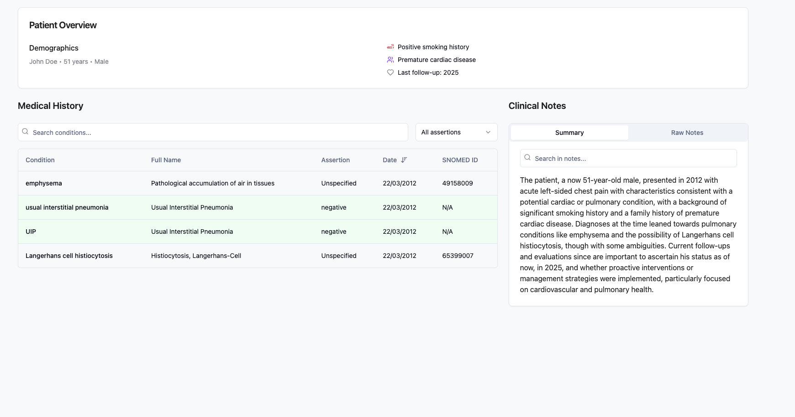

# Patient History Visualizer

## Overview

Patient History Visualizer is a modern web application designed to help healthcare professionals view and analyze patient medical records efficiently. The application provides a clean, intuitive interface for visualizing patient data, medical conditions, and clinical notes.



## Features

- **Patient Overview Dashboard**: View patient demographics, smoking history, family history, and follow-up information at a glance
- **Medical History Table**: Interactive table for viewing medical conditions with:
  - Filtering by assertion status (positive, negative, unspecified)
  - Text search across conditions and SNOMED codes
  - Sortable columns for better organization
  - Color-coded rows based on assertion status
- **Clinical Notes Section**: Review clinical summaries and detailed notes
- **SNOMED CT Integration**: Display of standardized medical terminology codes

## Technology Stack

- **React**: UI component library
- **TypeScript**: Type-safe JavaScript
- **Vite**: Fast development environment
- **Tailwind CSS**: Utility-first CSS framework
- **shadcn/ui**: High-quality UI components
- **React Router**: Client-side routing
- **React Query**: Data fetching and state management

## Getting Started

### Prerequisites

- Node.js (version 14 or higher)
- npm or yarn

### Installation

```bash
# Clone the repository
git clone https://github.com/yourusername/patient-history-visualizer.git
cd patient-history-visualizer

# Install dependencies
npm install
# or
yarn install

# Start the development server
npm run dev
# or
yarn dev
```

The application will be available at `http://localhost:5173`

## Usage

The application displays a sample patient record on launch. In a production environment, you would integrate with your healthcare system's API to fetch real patient data.

### Sample Data Structure

The application expects medical conditions in the following format:

```typescript
interface MedicalCondition {
  name: string;          // Common name of the condition
  full_name: string;     // Full medical name
  assertion: string | null; // 'positive', 'negative', or null (unspecified)
  date: string;          // Date of diagnosis/mention
  patient: number;       // Patient identifier
  snomed_id: string;     // SNOMED CT code
}
```

## Customization

The application uses a custom medical color theme that can be adjusted in the Tailwind configuration:

- `text-medical-text`: Primary text color
- `text-medical-muted`: Secondary text color
- `text-medical-critical`: Warning indicators (e.g., positive conditions)
- `text-medical-highlight`: Emphasis color

## Contributing

Contributions are welcome! Please feel free to submit a Pull Request.

## License

This project is licensed under the MIT License - see the LICENSE file for details.

## Acknowledgments

- SNOMED International for medical terminology standards
- All contributors to the open-source libraries used in this project
